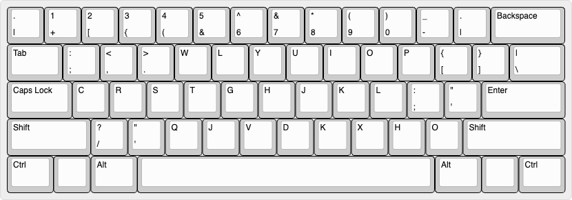
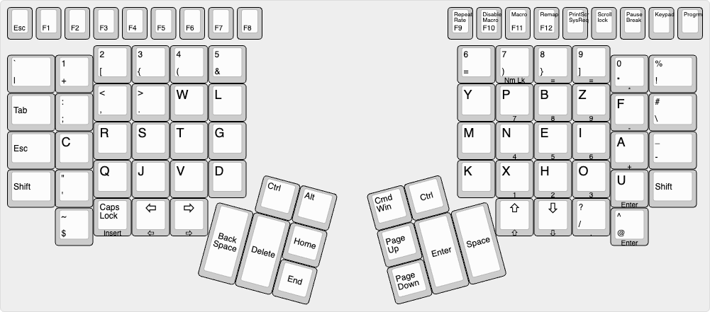

# Motivation
I tried to learn dvorak using ThePrimeagen's layout but it wasn't for me.
I have tried and enjoyed using canary before, and I also enjoyed the symbol layout from ThePrimeagen's layout, I thought why not try to combine the two and see what happens.

Standard Keyboard

ergo keyboard

